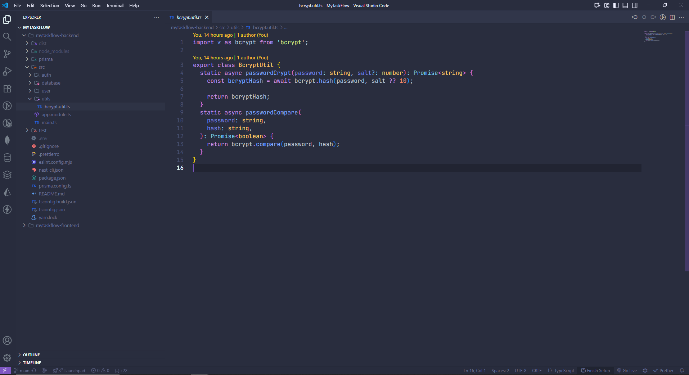
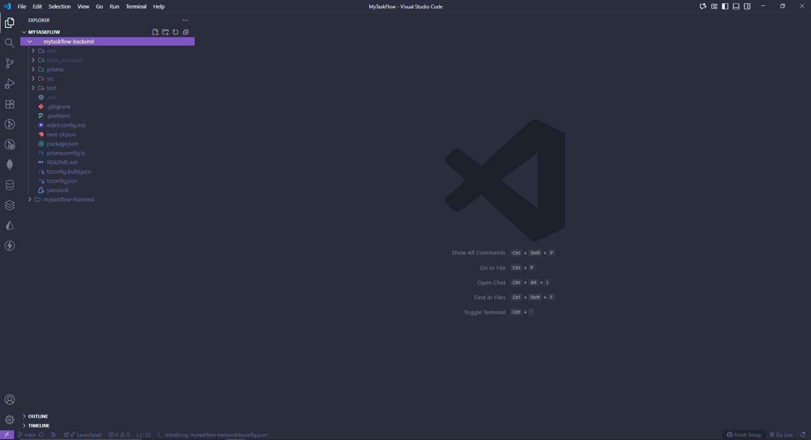

# vscode-configurations
VS Code setup

# 🧠 My Visual Studio Code Setup

A minimal and productive VS Code setup focused on clarity and clean aesthetics.  
I use **JetBrains Mono** as my main font and a dark theme for comfortable, long coding sessions.

---

## 🖼️ Preview

Here’s what my current setup looks like:

### 🔹 Workspace Overview

### 🔹 Editor in Action

---

## ⚙️ Main Configuration

My settings are defined in `settings.jsonc`, keeping everything explicit and versioned.
